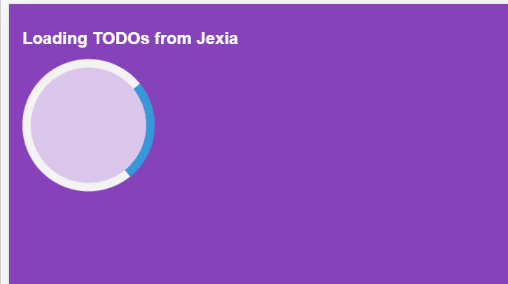

# todo-jexia-react
`todo-jexia-react` is a Proof of Concept project for using [Jexia](https://www.jexia.com/en/) along with a [Reactjs](https://reactjs.org/) app. What could be better than writing a TODO app? It's everyone's favorite. Isn't it?

# How to use it
- `yarn install`
- `yarn start` to start the app in dev mode.
- `yarn build` to build the app for production.

# See in Action

See it in [Action here](https://todo-jexia-react.netlify.com/).

# Demo

# Build and Deployment Status

Liked what I do? Thank You Very Much!

